<h1 align="center">Hello World! I'm Ricky</h1>

<!-- 

  Full-Stack Developer - IT Support Technician - Information Systems Technology Student

 -->

  <a href="https://RickySerrano.dev">RickySerrano.dev</a>

  <!-- <a href="https://www.linkedin.com/in/rickyricardo904">LinkedIn</a> -
  <a href="Ko-fi.com/rickyricardo904 ">Ko-Fi</a>

 -->

## About Me
Hello! My name is Ricky. I've always loved the world of computers and code, especially the ability to create things that make people smile, solve real problems, and make life a little easier. I enjoy building tools and interfaces that are simple, practical, and easy to use. With a background in IT support and a degree in Information Systems Technology, I've learned how to approach problems from both the technical side and the user's perspective.

  

## Tech Stack & Tools

### Languages

### Frameworks & Libraries

### Databases, DevOps & Platforms

### IT, Support & Productivity Tools

<!--  -->

  

<!-- 

  

 -->

<!-- 

  

 -->

  

